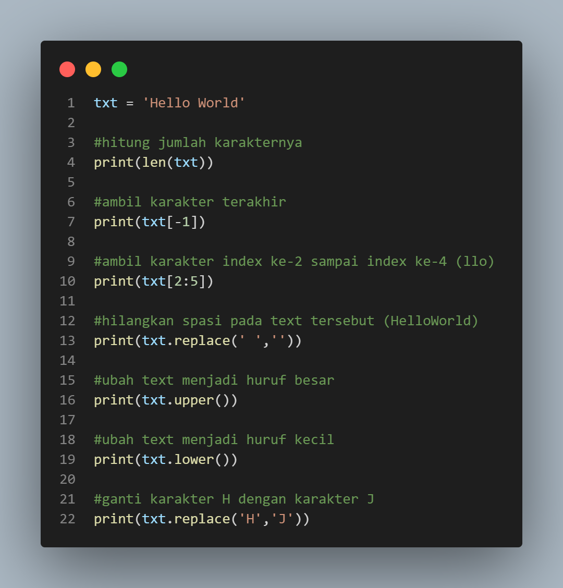
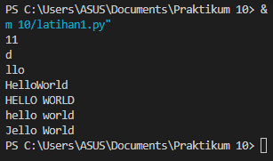
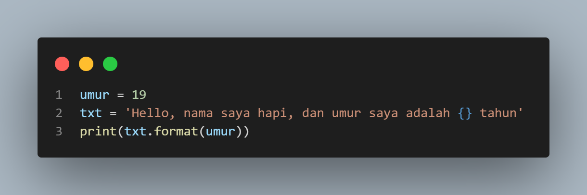
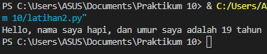

## Latihan 1

## Output

### Penjelasan Latihan 1
- dalam menghitung jumlah karakter bisa menggunakan fungsi `len` dalam bahasa python. contohnya `len(num)`, dimana len berfungsi untuk menghitung jumlah karakter.
- Cara mengambil karakter terakhir pada string yaitu menggunakan `index [-1]`.
- Cara mengambil karakter index ke-2 sampai ke-4 yaitu menggunakan `index [2:5]`.
- Cara menghilangkan spasi pada text (Hello World) yaitu menggunakan method `replace(' ','')`. dimana kutip yang ada spasinya ' ' diganti dengan yang tidak ada spasinya ''.
- Cara mengubah text menjadi besar yaitu gunakan method `upper()`.
- Cara mengubah text menjadi kecil yaitu menggunakan method `lower()`.
- Cara mengubah huruf 'H' dengan huruf 'J' yaitu menggunakan method replace().

## Latihan 2

## Output

### Penjelasan Latihan 2
- Untuk memasukkan variabel kedalam string, tambahkan kurung kurawal {} untuk ,menempatkan variabel sebelumnya.
